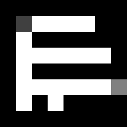
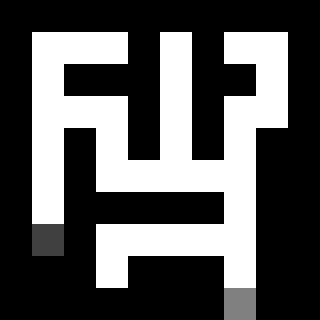
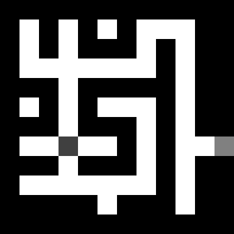
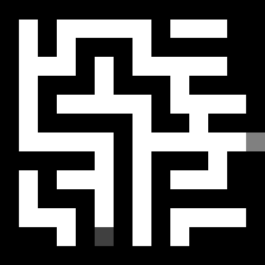
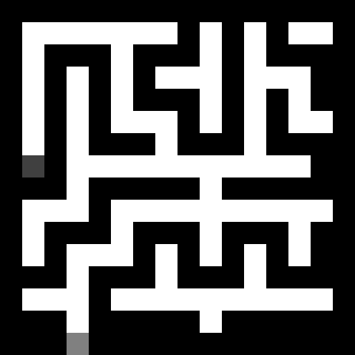
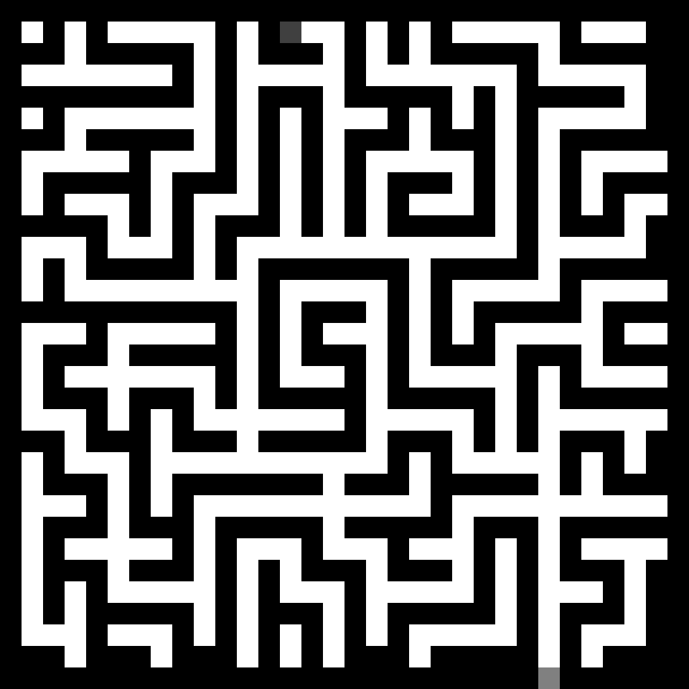

# Q-Learning based maze solver

Q-Learning based maze solver written from scratch using numpy, matplotlib (for visualization), pandas (for saving Q-Table as .csv file) and scikit-image (for reading maze image)

7 mazes are available:

* 8x8
  

* 10x10
  

* 12x12
  

* 14x14
  

* 16x16
  

* 32x32
  

* 64x64
  

If you want to try different mazes, you can pass them as parameter to Agent initializer

Cell size is parameter for max pooling, because original mazes were created using GIMP and needed to reduce dimensionality to make each cell to be exactly 1 pixel

Cells colored with #404040 and #808080 are starting position and goal respectively
